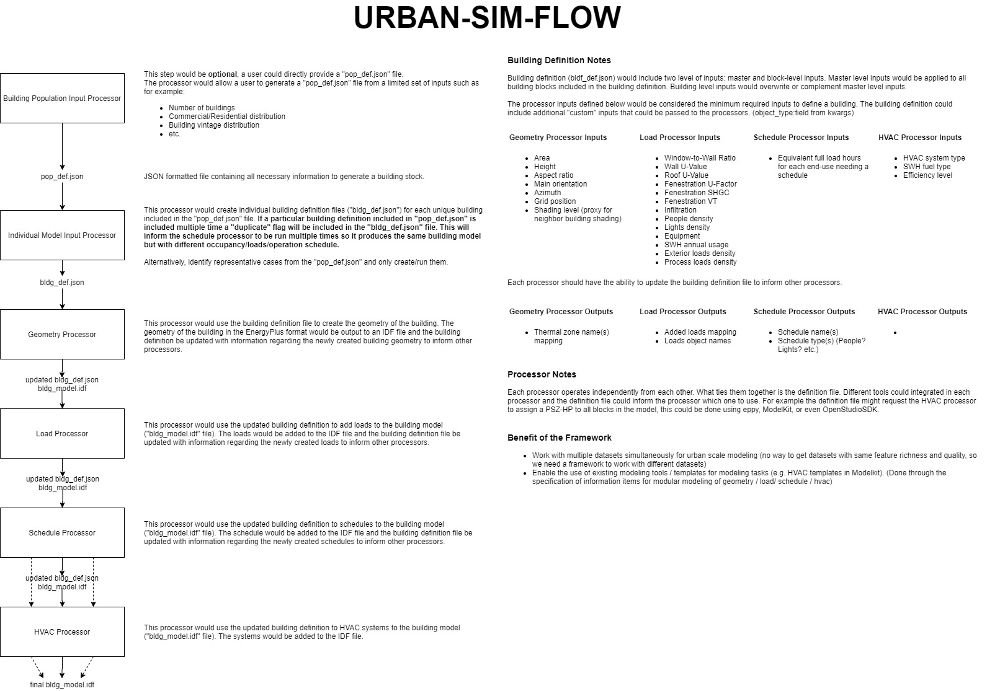

# Discussions notes

organized in chronological order

## Meeting minutes for discussion on 01/14/2020

### About "Lego" modeling approach

- We had two different "Lego" modeling approach on the table
  1. Simplify and disassemble a building model into multiple bricks according to thermal zones and for each brick, creating a separate model (idf) and run simulation against
  2. Simplify and disassemble a building model into multiple bricks according to thermal zones, but all bricks are still inside one model (idf) and will be simulated together
     We lean towards the second approach
- If everything is a single zone system, then either of the above two approaches works. If it is a multi-zone system, then approach 1 won't work. Within the same idf, we can assign multiple zones in the same HVAC system.

### Do we want to have pre-simulated load profiles to answer questions

- This depends on the application. Most use cases would require us to run simulations and that the main capability we target.

### Benefits of the proposed modeling approach

- Comparing with ground up case-specific modelling (i.e. modeling in our prototypes), in this project, we do on the fly zoning and would have more flexibility. Easier to troubleshooting, and do benchmarking
- Comparing with existing simulation-based benchmarking tool. Our lego modeling approach is more sophisticated and is expected to yield more accurate results. In FY20, we'll not have have much effort to do benchmarking. We can do two things: 1) to compare the shape and order of magnitude of aggregated load curve with some existing ones; 2) to compare our results from logo-based prototype models with those from a corrsponding EPSTD prototype models.
  - This needs to be confirmed.
  - Comparing with Comcheck?
  - Some earlier benchmarking tool would build a simple rectangle space model to simulate the baseline energy usage.

### Potential issues (not in the FY20 scope)

- Inter-building shading: LBNL's Tianhen Hong developed an EP feature to capture the inter-bldg shading impact. More detailed information is not acquired yet.
- Inter-building airflow impact: Unknown knowledge

### Zoning heuristics

- Rules in the ASHRAE appendix C is probably a better resource than digging the Comcheck source code.
- Jerry will have a look at the appendix and Jian will lead Jerry on it later.

### More

- Yunyang did a review on existing large scale modeling approaches, this is potentially very helpful and we shall later have him involved in the project. (Jian will decide when to include him)
- Since several third-party software, e.g. Eppy/Geomeppy, Modelkit, openstudio, has templates or routines to automatically inject HVAC systems in to the model. We shall aim at developing a set of interfaces to talk to these tools when building our models. This can also be a selling point especially since we are building and showcasing a framework

## Additional information from discussion between Jian and Jerry on 01/22/2020

- We are going to divide the model generation step into the following separate steps and tackle each with different focuses
  1. geometry
     - this requires heavy development work. The general idea is to follow the ASHRAE 90.1 App C. The target is to have a simplified and modular way to create geometry and zoning following the idea of App C. The end results will not be as detailed as What's been done in COMCheck. We need to show the lego idea without considering sophisticated systems and scenarios / corner cases.
     - Rewrite COMCheck code into Python code leveraging eppy is too much work for this project. We will just use App C and simplify details while keeping the conceptual ideas.
     - This would not be a selling point of the project
  2. load
     - We will leverage existing methods in COMCheck and Asset Score projects to generate loads.
  3. schedule
     - We will leverage the method being developed in the OCC sensor project to generate the schedules.
  4. HVAC systems
     - More discussion is needed to substantiate this part
     - In this part, we will try to develop a framework selling point of having different interfaces utilizing existing HVAC system templates from
       - Eppy
       - Modelkit
     - We need to double check the appropriateness of interfacing with Eppy / Modelkit templates. It should be fine though.
- We are still in the stage of planning, but we are getting things clearer. We may need to organize a meeting with everybody (Jian, Jeremy, Yunyang, Jerry, Yan, Amanda) and collect feedback and thoughts to finalize and detail the plan, and discuss the potential use case / analysis of the large scale simulation results.

## Meeting minutes from meeting w/ Jian, Jeremy, Yunyang, Jerry on 01/30/2020

Texts in `[]` are Jerry's comments while taking the notes.

- gap to fill: evaluate impacts at large scale of buildings instead of individual buildings
- selling point of nrel comstock: use the original prototypes and scale them to simpler stretched geometry etc.
- no typical method to analyze the results in existing studies.
- PNNL internal reviews emphasizes the gap of limited stock data and from different sources / formats. This is not what we want. We don't want to provide data to other people, we want to create end-to-end framework to analyze the results. We want to replace others' method and provide better solution
- [we will need to have interfaces if we want to collaborate with other people, to use their existing implementations. So it is probably essential to have a detailed and standarlized process ot doing end-to-end urban-sim]

* possible data source: comcheck, rescheck (not a core of our work)
* Andrew Parker's presentation about comstock: collect data from different sources, e.g. census, in different formats

### BEM modeling strategy

- the overall plan is to convert building characteristics to BEMs
- the big assumption is: we won't be able to generate the exact shape of the building. We capture the total conditioned area of the bldg and the total exterior area of different surfaces
- another assumption: we believe the interactions between different thermal zones are negligible.
- we will create thermal zones that host the external envelope and host the floor areas as the user inputs, but the shape won't be accurate
- how to model multi-zone vav system having separate zones being tagged. This is not the current focus.
- why cannot we use comcheck to generate BEM: expandability of our way of doing the model. We can treat as if Comcheck does not exist and claim what we do in this project (the LEGO zoning etc) as the contribution.
- Yunyang: review of existing urban-scale simulation. Some do not fall in the focuses of our work, we may not need to have a review of the work, and we may not have the resources to do so. Jian has the frontiers of this area in mind and will discuss in our next meeting. I.e. Jian will talk about the existing tools doing urban-sim when we can meet together again.
- We will hold the implementation work until we figure out the detailed things we are going to do that are different from existing studies.

## 2nd meeting minutes on 01/30/2020

our calibration at bottom levels make it reasonable to study vibrations and interactions

others research, higher resolution means higher variances.

our calibration can calibrate time series

others calibration accumulative data.

## Modularized modeling process diagram

## March Action Items Planning

### March hour spending by the end of March

- Jian: 30hr
- Jeremy: 40hr
- Yunyang: 100hr
- Jerry: 100hr

### Action items derived from planning slides

#### Model generation development

_Assign following items to people_

| Action item (**Bold for immediate tasks**)                                                         | Outcome                                    | Assignee (tentative) | Task Schedule                    | Notes                                              |
| -------------------------------------------------------------------------------------------------- | ------------------------------------------ | -------------------- | -------------------------------- | -------------------------------------------------- |
| **1. Pick a specific bldg character vector and create idf objects generated after each processor** | several idfs                               | Yunyang              | Start with geometry idf by Mar 3 | we will discuss once Yunyang created the idf files |
| **2. Detail modeling strategy for Geometry Processor**                                             | narrative document / code with explanation | Jian, Jerry          | Start once geometry idf in place | deriving geometry info from cbecs raw data         |
| **3. Detail modeling strategy for Load Processor**                                                 | narrative document / code with explanation | Jeremy, Jerry        | After the above task             |
| 4. Detail modeling strategy for Schedule Processor                                                 | narrative document / code with explanation | Yunyang, Jerry       | After the HVAC processor (5)     |
| 5. Detail modeling strategy for HVAC Processor                                                     | narrative document / code with explanation | Jeremy, Yunyang      | Start once hvac idf inplace      |
| 6. Code detailed modeling strategies                                                               | working implementation                     | Yunyang, Jerry       | After all above                  |

#### Actions for other matters

- functional coding style. Jeremy is in charge.
- Discuss the following next question
  - post processing artifacts specification. Jeremy, Yunyang, Jerry
  - Framework infrastructure. Jerry.
    - Need to decide on whether using PIC or AWS once we have more details about what tasks we are dealing with wrt Post-processing data file size / number / operations.
